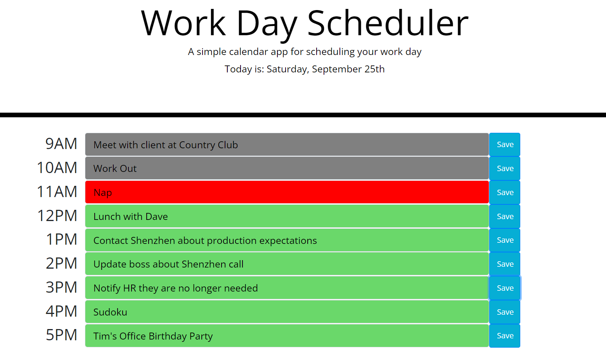

# Planner-Application-by-Vince
Use this planner in your daily life to keep track of your tasks.

### Website Features:
1) An updating date on the header that tells you what date it is
2) Text fields that allow you to input To-Do's for the day
3) The text fields change color based on the time of day: (red=current, gray=past, and green=future)
4) Saving the text keeps it in local storage so refreshing the page won't remove the text
5) Taking out the text and saving it removes the text in local storage

### What I learned from the creation of this site:
* Using the momoent library to set the date and format the date in the desired way
* Using the jQuery library to target elements and their values for manipulation
* Using the BootStrap library to rapidly create the save and text input elements
* Became more familiar with local storage and JSON functionality
* Changed the mouse pointer when over the text blocks so that it was more visible

Create your own planner for today at: [Vincent D Momot's Planner](https://vincentmomot.github.io/Planner-Application-by-Vince)

Screenshots of the site:
